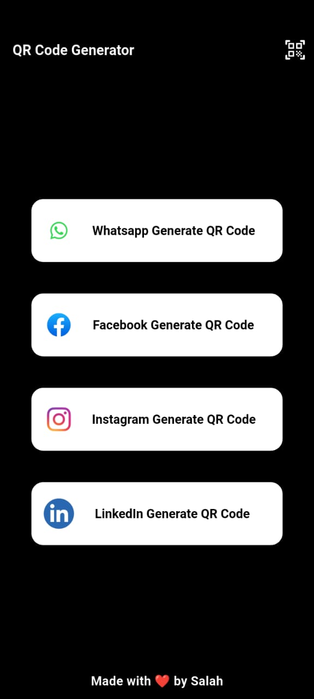
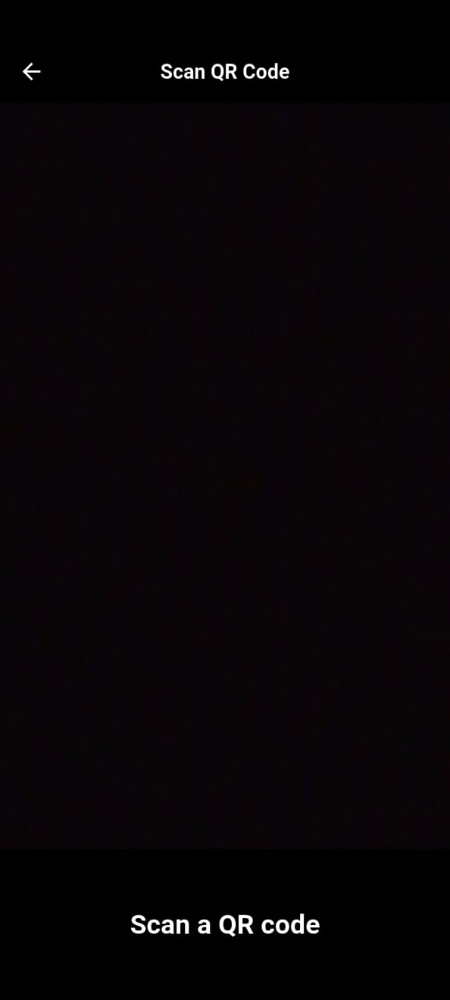
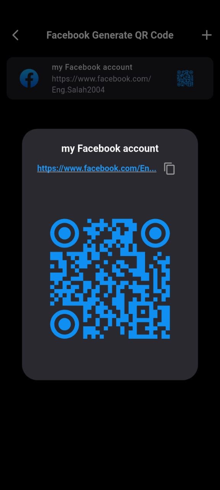

<div align="center">
  
  <h1 align="center">QR Generator</h1>
  <p align="center">
    A modern Flutter application for generating, scanning, and managing QR codes
    <br />
    <a href="#features"><strong>Explore Features »</strong></a>
    <br />
    <br />
    <a href="#screenshots">Screenshots</a>
    ·
    <a href="#getting-started">Getting Started</a>
    ·
    <a href="#architecture">Architecture</a>
    ·
    <a href="#contributing">Contributing</a>
  </p>
</div>

<br />

<p align="center">
  
  
  
  
</p>

---

## ✨ Features

### 📱 QR Code Generation

Generate QR codes for multiple use cases with built-in form validation and smart defaults:

| Category | Description |
|----------|-------------|
| **WhatsApp** | Phone number with country code → `wa.me` link |
| **Facebook** | Profile URL or custom text |
| **Instagram** | Profile URL or custom text |
| **LinkedIn** | Profile URL or custom text |
| **WiFi** | SSID + Password + Encryption type (WPA/WEP/None) |
| **Email** | To + Subject + Body → `mailto:` link |
| **vCard** | Name + Phone + Email + Organization → digital business card |
| **URL** | Any web link |
| **Text** | Plain text |
| **Custom** | User-defined categories with custom icon and color |

### 🎨 QR Code Customization

- Choose from **12 preset colors** per QR code
- Eye shapes: Square style
- High-resolution rendering via `qr_flutter`

### 📸 QR Code Scanning

- Real-time QR scanning using device camera
- Auto-detect URLs and open in browser
- Save scanned codes to **scan history** (last 50 scans)
- Category auto-detection (WiFi, vCard, Email, URL, Text)
- Copy scanned content to clipboard

### ❤️ Favorites & Search

- Mark QR codes as favorites for quick access
- Favorites carousel on the home screen
- Full-text search across all QR codes

### 💾 Export & Share

- Share QR codes as PNG images
- Copy QR data to clipboard
- Open associated URLs/links directly

### 🌙 Dark Mode

- Automatic theme switching based on system settings
- Material 3 with custom color scheme
- Optimized light and dark theme variants

---

## 📸 Screenshots

<p align="center">
  
  
  
  
</p>

---

## 🚀 Getting Started

### Prerequisites

- Flutter SDK `^3.7.0`
- Dart SDK `^3.7.0`
- Android Studio / VS Code with Flutter extensions

### Installation

```bash
# Clone the repository
git clone https://github.com/yourusername/qr_code.git

# Navigate to project directory
cd qr_code

# Install dependencies
flutter pub get

# Run the app
flutter run
```

### Build for Release

```bash
# Android APK
flutter build apk --release

# Android App Bundle
flutter build appbundle --release

# iOS (macOS only)
flutter build ios --release
```

---

## 🏗 Architecture

The app follows a **feature-first architecture** with **BLoC (Cubit)** state management:

```
lib/
├── app/
│   ├── data/           # State management (Cubits)
│   │   ├── qr_cubit.dart
│   │   ├── scan_history_cubit.dart
│   │   └── custom_category_cubit.dart
│   ├── models/         # Data models
│   │   ├── qr_code_model.dart
│   │   └── category_model.dart
│   ├── screens/        # UI screens
│   │   ├── home.dart
│   │   ├── category_screen.dart
│   │   ├── all_qr_screen.dart
│   │   ├── scan_qr_code.dart
│   │   └── custom_category_screen.dart
│   └── widgets/        # Reusable UI components
│       ├── qr_card.dart
│       ├── qr_view.dart
│       ├── qr_bottom_sheet.dart
│       └── no_qr.dart
├── core/
│   ├── constants/      # App-wide constants
│   └── utils/theme/    # Theme configuration
└── main.dart           # App entry point
```

### State Management

- **Generic QrCubit**: Single cubit handling all QR code CRUD operations across categories
- **ScanHistoryCubit**: Manages scan history (persisted locally)
- **CustomCategoryCubit**: Manages user-defined categories
- States use a sealed class hierarchy: `Initial`, `Loading`, `Success`, `Error`

### Data Persistence

All data is stored locally using `SharedPreferences`:
- QR codes stored as JSON-serialized strings
- Automatic migration from v1 storage format
- Scan history capped at 50 entries

### Dependencies

| Package | Purpose |
|---------|---------|
| `qr_flutter` | QR code rendering |
| `qr_code_scanner_plus` | Camera-based QR scanning |
| `bloc` / `flutter_bloc` | State management |
| `shared_preferences` | Local persistence |
| `url_launcher` | Opening links |
| `lottie` | Animations |
| `intl_phone_field` | International phone input |
| `share_plus` | Sharing QR images |
| `path_provider` | File system access |

---

## 🧪 Running Tests

```bash
flutter test
```

---

## 🤝 Contributing

Contributions are what make the open-source community such an amazing place! Any contributions you make are **greatly appreciated**.

1. Fork the Project
2. Create your Feature Branch (`git checkout -b feature/amazing-feature`)
3. Commit your Changes (`git commit -m 'feat: add amazing feature'`)
4. Push to the Branch (`git push origin feature/amazing-feature`)
5. Open a Pull Request

### Commit Convention

This project follows [Conventional Commits](https://www.conventionalcommits.org/):

- `feat:` — A new feature
- `fix:` — A bug fix
- `refactor:` — Code restructuring
- `redesign:` — UI/UX changes
- `docs:` — Documentation only
- `chore:` — Maintenance tasks

---

## 📄 License

Distributed under the MIT License. See `LICENSE` for more information.

---

## 🙏 Acknowledgements

- [Salah](https://github.com/salah) — Original creator and maintainer
- [qr_flutter](https://pub.dev/packages/qr_flutter) — QR code generation
- [qr_code_scanner_plus](https://pub.dev/packages/qr_code_scanner_plus) — QR scanning
- [Flutter BLoC](https://bloclibrary.dev/) — State management

---

<p align="center">
  Made with ❤️ by <a href="https://github.com/salah">Salah</a>
</p>
