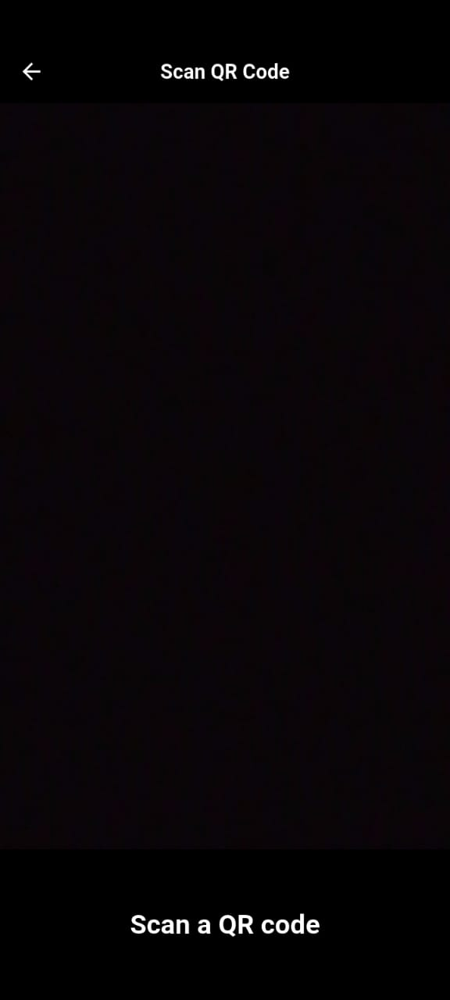

QR Scanner App
A Flutter-based QR code scanner application that allows users to scan QR codes and barcodes efficiently. The app supports scanning from the camera in real-time and provides quick access to scanned history.

Features
Real-time QR & Barcode Scanning: Scan QR codes and barcodes using the device's camera.

Scan History: View previously scanned codes in a list.

Copy to Clipboard: Easily copy scanned data for quick sharing.

Dark & Light Mode: Supports system theme preferences.

Responsive UI: Works smoothly on both mobile and tablet devices.

Screenshots
Home Screen 	Scanning Screen
	
Key Packages Used
qr_code_scanner: For camera-based QR/barcode scanning.

hive: Lightweight local database for storing scan history.

provider: State management for theme and data.

fluttertoast: For displaying toast notifications.

url_launcher: To open URLs directly from scanned data.

Installation
Clone the repository:

sh
git clone https://github.com/SalahFathy25/qr_scanner.git
Install dependencies:

sh
flutter pub get
Run the app:

sh
flutter run
Configuration
Ensure camera permissions are enabled in AndroidManifest.xml (Android) and Info.plist (iOS).

For release builds, configure the app signing and bundle identifiers.

Contributing
Pull requests are welcome! For major changes, please open an issue first to discuss the proposed changes.

License
This project is licensed under the MIT License. See LICENSE for details.
